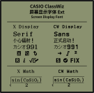

[繁體中文](https://github.com/haydenwong7bm/ClasswizDisplayExt/tree/main/README_zh-TC.md) [简体中文󠄁](https://github.com/haydenwong7bm/ClasswizDisplayExt/tree/main/README_zh-SC.md) **EN**

# CASIO ClassWiz Display Font Ext(ended)

**Bitmap font from CASIO ClassWiz calculator's display!**

## Language Support

(From the current font source file)

✅ English, Germany, Czech, Hungarian, Polish, Slovak, French, Spanish, Catalan, Basque, Portuguese, Vietnamese, Russian 
🟨 Japanese Kana 
⌠Greek, Arabic, Chinese Pinyin 

## Character Set Support

(From the current font source file)

✅ ASCII ([Wenti-D#2](https://github.com/Wenti-D/ClasswizDisplayExt/issues/2)) 
✅ ISO/IEC 8859-1 + Windows-1252 
🟨 ISO/IEC 8859-2 
🟨 ISO/IEC 8859-3 
🟨 ISO/IEC 8859-4 
🟨 ISO/IEC 8859-5 
⌠ISO/IEC 8859-6 
⌠ISO/IEC 8859-7 
⌠ISO/IEC 8859-8 (No plans to support) 
🟨 ISO/IEC 8859-9 
🟨 ISO/IEC 8859-10 
⌠ISO/IEC 8859-11 
🟨 ISO/IEC 8859-13 
🟨 ISO/IEC 8859-14 
🟨 ISO/IEC 8859-15 
🟨 ISO/IEC 8859-16

## How to Use

The font is in 4 parts: X Display, X Math, CW Display and CW Math. X version is serif, and CW version is sans-serif. Display version is used for normal text, provided in OTF, TTF and WOFF2 format; Math version is powered by OpenType MATH table, and is used for math expression input, only OTF format is provided.

All version of font releases can be downloaded in the [release page](https://github.com/haydenwong7bm/ClasswizDisplayExt/releases).

This README is just a rough description of the font, in additional to the font, the zip file also contains a documentation file (such as `README.pdf`).

If you think this project is helpful to you, you may click the ☆ on the upper right corner of the page.

## Build Font

Font source file is provided with the [FontForge](https://fontforge.org/) font file format, which is a file with `.sfd` extension. To edit and build the font, please install FontForge. You can also build the font with `build.py` through FontForge.

~~However `.sfd` file is a text document, so you can also edit it with a text editor.~~

## Contribution and Feedback

"ClassWiz Display Ext" font is all licensed under the SIL Open Font License Version 1.1 agreement authorization, For details, please see the `OFL.txt` file. If you want to edit and redistribute the font, please be sure to comply with the license agreement. If you have any problems or suggestions, please open an issue.